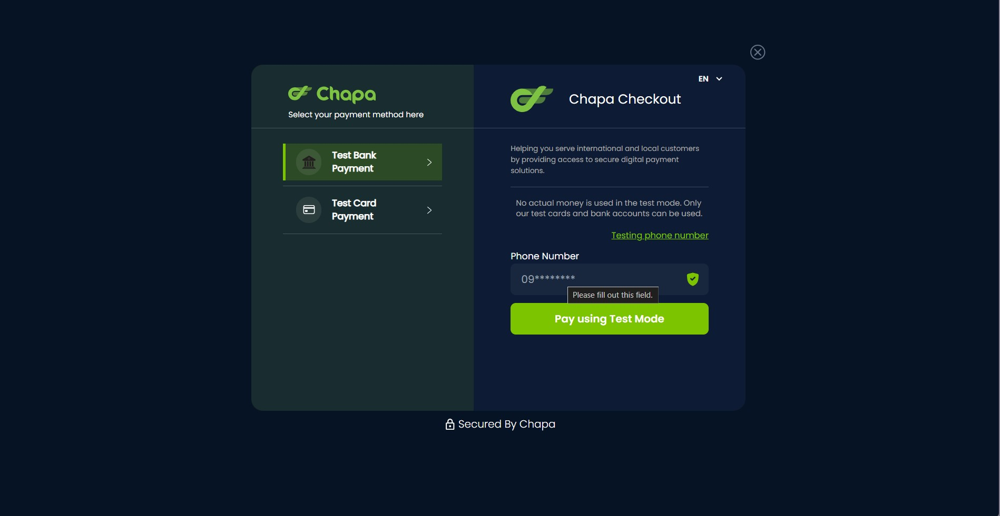
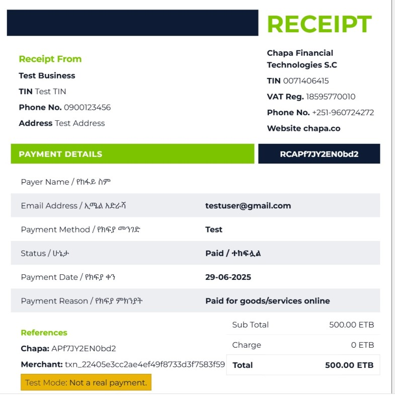

# 🧾 Chapa Payment Integration with Django

This project demonstrates **how to integrate Chapa's Payment Gateway API** into a Django-based application for booking and payment processing.

The goal of the project is to provide hands-on experience with:
- Handling API-based payment initialization and verification
- Using Celery for background tasks (e.g., sending confirmation emails)
- Working with real-time payment data
- Following best practices in Django for clean, testable code

---

## 🛠️ Tech Stack

- **Backend:** Django (DRF)
- **Payments:** [Chapa API](https://docs.chapa.co/docs/)
- **Background Tasks:** Celery + Redis
- **Database:** SQLite (for development)
- **Other Tools:** Postman, Django Admin

---

## ⚙️ Features

- 📤 **Initiate Payments**: Users can initiate payments for listings using Chapa's hosted payment page.
- 🔁 **Verify Payments**: After payment, the transaction is verified using Chapa’s verification endpoint.
- 📬 **Email Confirmation**: Upon successful verification, the user receives an automated confirmation email via Celery.
- 🔐 **Safe & Atomic**: Booking and payment creation handled within a Django transaction to ensure consistency.

---

## 🚀 How It Works

### 1. **Initiate Payment**
POST to `/api/initiate-payment/` with:
```json
{
  "listing_id": 1,
  "check_in": "2025-07-01",
  "check_out": "2025-07-05",
  "guests": 2,
  "amount": 1000,
  "phone_number": "0912345678"
}

## 📸 Screenshots

### 🧾 Chapa Checkout Page


---

### 🧾 Test Payment Receipt

